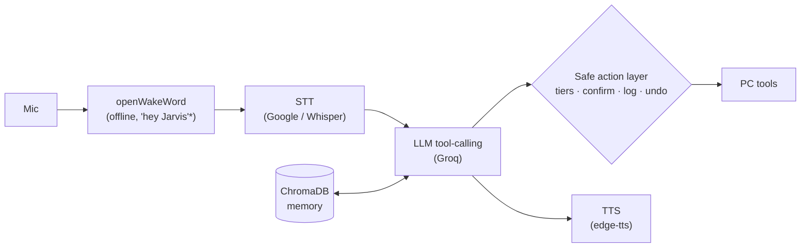

# KAVACH: a Hinglish voice assistant with a safe action layer

*KAVACH — Knowledgeable Assistant with Verified Action Confirmation & Handling (also Hindi for "shield")*

A Windows voice assistant that understands mixed Hindi-English commands and acts on your PC, with permission tiers, confirmation for risky actions, an audit log and undo.

<!-- DEMO GIF HERE: record with ScreenToGif, ~20s: wake word -> volume up -> "undo that" -> "resume kholo" -> Y confirm -->

## How it works



## Safe action layer (`safety.py`)

| Tier | Behavior | Examples |
|---|---|---|
| 0 | Auto-run | time, recall, file search |
| 1 | Auto-run, logged, undo where possible | open app, volume, screenshot, reminder, remember |
| 2 | Spoken read-back + keypress confirm (10 s, no answer = denied) | opening a file |
| 3 | Blocked (also the default for unknown tools) | anything not in the tier table |

- **Audit log:** every action is stored in SQLite (`kavach_actions.db`) with transcript, tool, arguments, tier and result. View it with `python safety.py`.
- **Undo:** "undo that" reverses volume changes, screenshots (moved to a trash folder), reminders and remembered facts. Opened apps and searches are not undoable.

## Evaluation

Metric: task success, meaning the right tool and the right arguments, on 61 commands (36 Hinglish romanized, 15 Devanagari Hindi, 10 English, 6 should-do-nothing). Commands are in `eval/commands.jsonl`.

| Setup | Task success |
|---|---|
| LLM intent only (typed text) | 95.1% (58/61) |
| Google STT (hi-IN) + LLM | 93.4% (57/61) |
| Google STT (en-IN) + LLM | 95.1% (58/61) |
| Whisper (local, small, auto language detect) + LLM | 75.4% (46/61) |

Reproduce: `python eval_hinglish.py text`, then `record`, then `audio --stt google-hi` (or `--stt whisper`).

Local Whisper trails cloud STT specifically on romanized Hinglish (64% vs. 94-97%) — the small model's language detector guesses inconsistently on short, code-switched, romanized audio (sometimes even picking Urdu or Norwegian script for the same phrase). This is a known hard case for general-purpose ASR; a larger Whisper model or a Hinglish-specific model (e.g. Sarvam, AI4Bharat) would likely close the gap, at the cost of no longer being fully local. Cloud STT remains the accuracy-first default; Whisper is the offline/local-first option, with this trade-off documented rather than hidden.

Remaining failures are mostly recording cut-offs on trailing words/names and STT mishearing (e.g. "paint" → "पेट"); see `eval/results_*.json` for details.

Limitations: the command set was written by one person and is cleaner than real speech; single speaker; one accent.

## Setup

```
python -m venv venv
venv\Scripts\activate
pip install -r requirements.txt
$env:GROQ_API_KEY="your-key"
python kavach.py
```

Say "hey Jarvis"*, wait for the beep, then speak. Say "stop" after the beep to quit.

\* The spoken wake phrase is still "hey Jarvis" — it uses openWakeWord's pretrained `hey_jarvis` model. Training a custom "hey Kavach" model is future work (see Roadmap).

Tests: `pip install pytest` then `python -m pytest tests -q`.

## Roadmap

- Local-only mode (Ollama + local STT/TTS) with a per-component toggle
- Sarvam STT backend in the eval
- Voice-only confirmation for tier 2 (currently keypress, on purpose, so a misheard "yes" can't approve an action)
- Custom "hey Kavach" wake-word model (currently uses openWakeWord's pretrained `hey_jarvis` model)